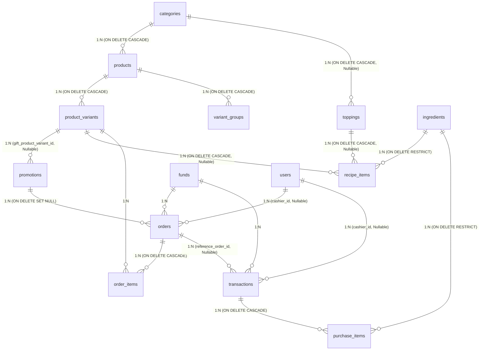

# RabbitPOS - Database Inventory & Schema Audit (Phase 0)

> **Tài liệu kiểm kê toàn diện cơ sở dữ liệu PostgreSQL & GORM cho dự án RabbitPOS**  
> **Schema Version thực tế**: `v1.19` (Migration `000019_ingredient_conversion_and_costing.up.sql`)  
> **Ngày kiểm kê**: 2026-08-28

---

## 1. Danh Mục Kiểm Kê 16 Bảng (GORM / PostgreSQL)

Hệ thống RabbitPOS bao gồm **16 bảng** dữ liệu quan hệ, được chia theo các miền nghiệp vụ:

| STT | Tên Bảng (Table) | GORM Model | Miền Nghiệp Vụ (Domain) | Mục Đích Sử Dụng |
| :--- | :--- | :--- | :--- | :--- |
| 1 | `categories` | `models.Category` | Catalog & Menu | Phân loại đồ uống / sản phẩm (Cà phê, Trà sữa...) |
| 2 | `products` | `models.Product` | Catalog & Menu | Sản phẩm/món trong thực đơn POS |
| 3 | `product_variants` | `models.ProductVariant` | Catalog & Menu | Biến thể kích thước/tùy chọn (Size M, Size L...) kèm giá bán lẻ & giá vốn |
| 4 | `variant_groups` | `models.VariantGroup` | Catalog & Menu | Nhóm modifier/thuộc tính tùy chọn của sản phẩm |
| 5 | `toppings` | `models.Topping` | Catalog & Menu | Topping/món thêm (Trân châu, Thạch...), hỗ trợ gắn theo Category hoặc Toàn cục |
| 6 | `funds` | `models.Fund` | Tài chính & Sổ quỹ | Quỹ tiền mặt, Tài khoản ngân hàng, Ví điện tử |
| 7 | `transaction_categories` | `models.TransactionCategoryItem` | Tài chính & Sổ quỹ | Danh mục thu/chi (Doanh thu POS, Mua nguyên liệu, Điện nước...) |
| 8 | `transactions` | `models.Transaction` | Tài chính & Sổ quỹ | Sổ cái dòng tiền (Thu / Chi), liên kết đơn hàng hoặc chi mua NVL |
| 9 | `promotions` | `models.Promotion` | Khuyến Mãi & Giảm Giá | Chương trình giảm giá (% / tiền mặt) hoặc tặng món |
| 10 | `orders` | `models.Order` | Bán Hàng (POS) | Hóa đơn bán hàng, ghi nhận thanh toán, giảm giá, phí ship/phụ phí |
| 11 | `order_items` | `models.OrderItem` | Bán Hàng (POS) | Chi tiết món trong hóa đơn (snapshot giá, snapshot JSON topping) |
| 12 | `ingredients` | `models.Ingredient` | Nguyên Vật Liệu & BOM | Danh mục nguyên vật liệu, hoa quả, bao bì; quy đổi đa cấp, tỷ lệ hao hụt, giá vốn cơ sở |
| 13 | `purchase_items` | `models.PurchaseItem` | Chi Tiết Nhập Hàng | Chi tiết các mặt hàng mua vào trong giao dịch chi (`transactions`), lưu thông số đóng gói |
| 14 | `recipe_items` | `models.RecipeItem` | Định Lượng Công Thức (BOM) | Tỷ lệ định lượng NVL cho từng biến thể món (`product_variants`) hoặc `toppings` |
| 15 | `users` | `models.User` | Người Dùng & RBAC | Tài khoản người dùng (admin, staff/cashier), mật khẩu bcrypt, email báo cáo |
| 16 | `settings` | `models.Setting` | Cấu Hình Hệ Thống | Cấu hình Key-Value (Tên quán, Logo, VietQR, SMTP, Google Sheets Sync, Auto-Tagging) |

---

## 2. Bản Đồ Khóa Ngoại (Foreign Key Dependency Graph)



---

## 3. Thứ Tự Topo Chuẩn Xác Cho Export & Restore

### A. Thứ tự Nạp Dữ Liệu / Khôi Phục (Topological Insertion Order)
Khi restore từ bản backup hoặc seed dữ liệu mới, bắt buộc phải nạp theo thứ tự từ các bảng độc lập (bậc 0) đến các bảng phụ thuộc sâu nhất:

1. `settings` *(Độc lập, không có FK)*
2. `users` *(Độc lập, không có FK)*
3. `funds` *(Độc lập, không có FK)*
4. `transaction_categories` *(Độc lập, không có FK)*
5. `categories` *(Độc lập, không có FK)*
6. `ingredients` *(Độc lập, không có FK)*
7. `products` *(Phụ thuộc `categories.id`)*
8. `toppings` *(Phụ thuộc `categories.id` nullable)*
9. `product_variants` *(Phụ thuộc `products.id`)*
10. `variant_groups` *(Phụ thuộc `products.id`)*
11. `promotions` *(Phụ thuộc `product_variants.id` nullable)*
12. `recipe_items` *(Phụ thuộc `product_variants.id` nullable, `toppings.id` nullable, `ingredients.id`)*
13. `orders` *(Phụ thuộc `funds.id`, `promotions.id` nullable, `users.id` nullable)*
14. `order_items` *(Phụ thuộc `orders.id`, `product_variants.id`)*
15. `transactions` *(Phụ thuộc `funds.id`, `orders.id` nullable, `users.id` nullable)*
16. `purchase_items` *(Phụ thuộc `transactions.id`, `ingredients.id`)*

### B. Thứ tự Xóa Dữ Liệu Dọn Dẹp Trước Khi Restore (Reverse Dependency Order)
Khi xóa sạch dữ liệu trước khi restore (trong cùng 1 DB transaction), phải xóa theo chiều ngược lại để tránh lỗi vi phạm ràng buộc khóa ngoại (Foreign Key Constraint Violation):

```sql
DELETE FROM purchase_items;
DELETE FROM order_items;
DELETE FROM transactions;
DELETE FROM orders;
DELETE FROM recipe_items;
DELETE FROM promotions;
DELETE FROM variant_groups;
DELETE FROM product_variants;
DELETE FROM toppings;
DELETE FROM products;
DELETE FROM ingredients;
DELETE FROM categories;
DELETE FROM transaction_categories;
DELETE FROM funds;
DELETE FROM users;
DELETE FROM settings;
```

---

## 4. Bảng Ghi Nhận Sai Lệch (Discrepancy Audit)

| Hạng Mục | Trong Tài Liệu Cũ (`4_DATABASE_SCHEMA.md`) | Trong Migrations Thực Tế (`000001` - `000019`) | Trong GORM Models Backend | Tình Trạng & Hành Động Cần Thiết |
| :--- | :--- | :--- | :--- | :--- |
| **Schema Version** | Ghi nhận đến Migration `000018` | Có đầy đủ đến `000019` | Đồng bộ với `000019` | Cập nhật tài liệu schema lên version `1.19` |
| **Bảng `ingredients`** | Chỉ có 7 cột cơ bản: `name, category, unit, yield_rate, latest_purchase_price, average_purchase_price` | Migration `000019` bổ sung: `base_unit, loss_rate, default_purchase_unit, default_pack_qty, default_pack_unit, default_capacity_qty, default_capacity_unit, saved_conversions` | Struct `models.Ingredient` có đầy đủ 15 trường | Tài liệu thiếu các cột quy đổi đa cấp |
| **Bảng `purchase_items`** | Chỉ có 5 cột: `quantity, unit, unit_price, subtotal` | Migration `000019` bổ sung 14 cột quy đổi: `purchase_unit, purchase_quantity, purchase_unit_price, pack_qty, pack_unit, capacity_qty, capacity_unit, conversion_rate, total_base_quantity, base_unit, base_unit_price, loss_rate, effective_base_quantity, effective_base_price, conversion_spec` | Struct `models.PurchaseItem` có đầy đủ 19 trường | Tài liệu chưa cập nhật chi tiết quy đổi đóng gói |
| **Bảng `variant_groups`** | Bị bỏ sót hoàn toàn khỏi tài liệu | Có từ Migration `000001` | Struct `models.VariantGroup` tồn tại | Đã bổ sung vào kiểm kê |
| **Bảng `toppings` FK** | Ghi `category_id BIGINT FK -> categories.id` | Migration `000008` có `ON DELETE CASCADE` | `models.Topping` chưa ghi rõ tag `constraint:OnDelete:CASCADE` | DB constraint thực tế được quản lý bởi SQL migration |
| **Bảng `users.email`** | Ghi `VARCHAR(255) NULL` | Migration `000014` tạo `VARCHAR(150) NOT NULL DEFAULT ''` | `models.User.Email` là `VARCHAR(150)` | Tài liệu cũ sai lệch kiểu dữ liệu |
| **Bảng `users.role`** | Ghi `admin, cashier (staff)` | Migration `000004` mặc định `staff` (`'admin', 'staff'`) | `models.RoleAdmin = "admin"`, `models.RoleStaff = "staff"` | Thống nhất thuật ngữ mã hệ thống: `admin` và `staff` |
| **Lỗ hổng Backup/Restore** | Không đề cập | `000018` và `000019` tạo 3 bảng mới | `handlers/backup.go` & `models/backup.go` **bị thiếu 3 bảng**: `ingredients`, `purchase_items`, `recipe_items` | **Rủi ro nghiêm trọng**: Cần nâng cấp backup payload sang Version 2.0 ở phase tiếp theo |
| **Bảo mật Secret trong Backup** | Không đề cập | `settings` lưu SMTP password và Google Service Account JSON | `models.Setting` lưu plain-text, xuất thẳng ra file JSON backup | **Rủi ro rò rỉ secret**: Cần mã hóa secret (ADR-003) |

---

## 5. Kết Luận Kiểm Kê & Baseline Cho Các Phase Sau

1. **Số lượng bảng chuẩn**: 16 bảng quan hệ.
2. **Schema Version chính thức**: `v1.19` (tương ứng migration `000019`).
3. **Phạm vi nghiệp vụ**: Giữ vững tiêu chí không làm module tồn kho/stock; toàn bộ các bảng `ingredients`, `purchase_items`, `recipe_items` chỉ phục vụ mục đích **Quy đổi đơn vị, tính Cost món (COGS) và hạch toán dòng tiền thực tế**.
