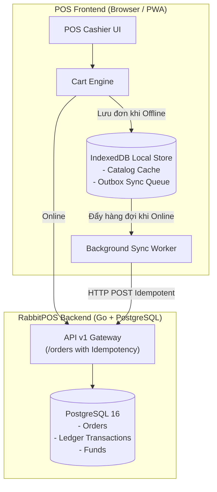

# ADR-004: Kiến Trúc Offline POS & Chiến Lược Giải Quyết Xung Đột (Offline POS & Conflict Resolution)

## Trạng thái (Status)
Đã duyệt (Approved) - Baseline Phase 0

## Bối cảnh (Context)
RabbitPOS phục vụ tại quầy đồ uống/cà phê với yêu cầu vận hành liên tục không gián đoạn ngay cả khi mất kết nối Internet hoặc mất mạng cục bộ.
**Ràng buộc nghiệp vụ quan trọng**:
- RabbitPOS **tuyệt đối không quản lý kho/tồn kho** (không kiểm tra số lượng tồn, không trừ kho khi bán).
- Trọng tâm nghiệp vụ: Đảm bảo tính đúng tiền, áp đúng khuyến mãi, in hóa đơn nhanh, lưu trữ đơn hàng an toàn, và đồng bộ chính xác vào Sổ cái Dòng tiền (`transactions`) và Báo cáo Doanh thu/Lợi nhuận khi có mạng trở lại.

## Quyết định Kiến trúc (Decision)

### 1. Kiến trúc Local-First trên Client
- **Lưu trữ cục bộ**: Sử dụng **IndexedDB** (qua thư viện nhẹ như `Dexie.js` hoặc native IndexedDB API wrapper) để lưu trữ:
  1. `catalog_cache`: Toàn bộ danh mục, sản phẩm, biến thể, topping, chương trình khuyến mãi hiện hành.
  2. `outbox_orders`: Hàng đợi các đơn hàng được tạo khi Offline (Outbox Pattern).
  3. `settings_cache`: Cấu hình thông tin cửa hàng, thông tin tài khoản VietQR.

### 2. Định Danh Đơn Hàng Độc Lập (Client Unique Order Code)
- Để tránh trùng lặp mã đơn giữa các máy POS khi mất mạng, mã đơn hàng được sinh theo cấu trúc phân tán:
  `ORD-{TerminalID}-{YYYYMMDD}-{Timestamp}-{Random4}`
  *Ví dụ: `ORD-POS1-20260828-153022-8A4F`*

### 3. Chiến Lược Đồng Bộ & Giải Quyết Xung Đột (Conflict Resolution Strategy)
1. **Đối với Đơn hàng (`orders`)**:
   - **Mô hình Append-Only**: Đơn hàng Offline là các bản ghi tạo mới, không ghi đè lẫn nhau.
   - Khi có mạng trở lại, Background Sync Worker gửi tuần tự các đơn trong Outbox lên backend với Header `Idempotency-Key = order_code`.
   - Backend tiếp nhận, chèn đơn hàng, cộng dồn số dư Quỹ tiền mặt (`funds.current_balance`), và ghi nhận giao dịch thu tiền (`transactions`) với mốc thời gian gốc (`created_at`) của đơn hàng.
2. **Đối với Danh mục & Giá thực đơn (`catalog`)**:
   - Áp dụng nguyên tắc **Server-Authoritative with Last-Write-Wins (LWW)**.
   - Khi Online, POS tải phiên bản mới nhất từ Server và cập nhật đè vào IndexedDB.
   - Các đơn hàng đã bán trong lúc Offline giữ nguyên giá trị snapshot (`unit_price`, `line_total`, `selected_toppings`) tại thời điểm tạo đơn, không bị tính lại theo giá mới của server.
3. **Đối với Khuyến Mãi Giới Hạn Lượt Dùng (`usage_limit`)**:
   - Các khuyến mãi có giới hạn số lượt (`usage_limit > 0`) khi áp dụng Offline sẽ được Server đối soát theo thứ tự tiếp nhận. Nếu vượt quá hạn mức, Server vẫn chấp nhận đơn hàng đã thanh toán cho khách và ghi chú cờ cảnh báo `promo_overlimit_audit` để Admin hậu kiểm, tránh tình trạng hủy đơn làm gián đoạn trải nghiệm của khách tại quầy.

## Hệ quả (Consequences)
- **Tích cực**: Quầy thu ngân hoạt động trơn tru 100% khi mất mạng; không nghẽn luồng bán hàng; tự động đồng bộ khi có kết nối trở lại mà không gây sai lệch sổ quỹ.
- **Cần xử lý**: Triển khai Service Worker caching và Outbox Queue trong module Frontend ở các phase tiếp theo.
